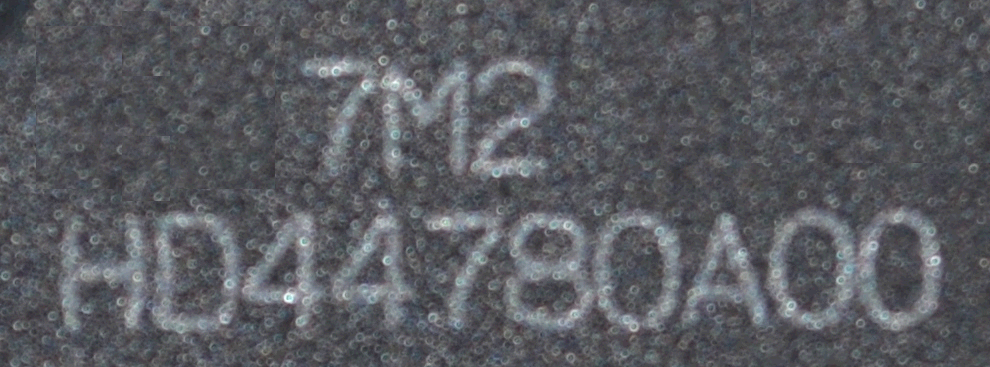
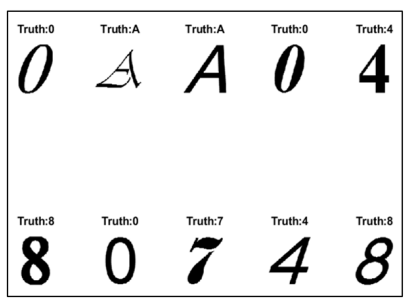
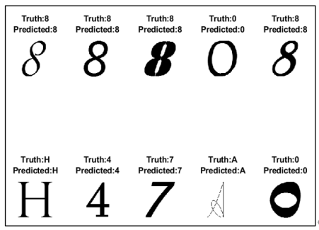
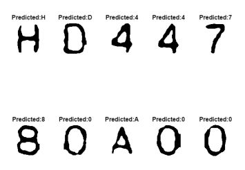
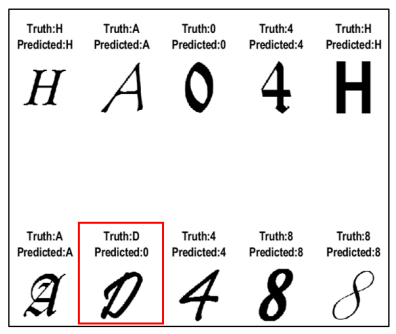
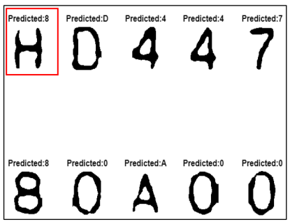

# Robot Vision and AI Final Project
 Character Recognition Model using Convolutional Neural Networks and Support Vector Machines

## Overview :

Figure 1: BMP image of a chipset

The goal of this lab project was to build a Character Recognition Model using a CNN (Convolutional Neural Network) and compare it's effectiveness and efficiency with a non-CNN based approach. 

A BMP image of a chipset (Figure 1) was provided to us. The task was to implement classical computer vision techniques for image smoothing, sub-image creation, outlining and segmentation of the characters and finally, classifying the characters using both the above mentioned character classification techniques.

A sample of the dataset that was used for training has been provided below:

Figure 2: Sample of Training Data

## Instructions :

- Kindly open and run **main.mlx**. The results for the tasks are visible in the live script. You can re-run this file to visualize results again. Either of the two (CNN and SVM) trained models can be used for character recognition by specifying model in code script.

- **algorithms** folder contains codes for image preprocessing techniques.

- **Categories** folder contains the dataset on which both the character recognition models were trained on. The dataset was divided into training set and validation set.

- **Segmented_characters** folder contains the outputs of part 1, i.e. it contains segmented characters. These segmented characters are then given to the trained models for classification and generating appropriate labels.

- **src** contains the given BMP image of the microchip.

- **CNN_architecture.m** contains the code to train the CNN model and evaluate its performance on the validation set. The training process has been already carried out and the trained network is stored in **CNN_Trained_Model.mat** file.

- **SVM_architecture.m** contains the code to train the SVM based model and evaluate its performance on the validation set. The training process has been already carried out and the trained network is stored in **SVM_Trained_Model.mat** file.

- **Recognition.mat** contains the code to recognize and label the characters segmented in Part 1 of the project using either of the trained models. The trained model can be selected in the code script. The segmented characters are loaded from the folder **Segmented_characters**.

## Results :

### CNN

Figure 3: Labels predicted by CNN on validation set

Figure 4: Labels predicted by CNN for the segmented characters

### SVM 

Figure 5: Labels predicted by SVM on validation set

Figure 6: Labels predicted by SVM for the segmented characters

It was observed that performance of both trained classifiers on the provided dataset was strong. However, the CNN based classifier performed by a slight margin on the segmented characters. This can be attributed to CNN's capability to learn both low-level and high-level features allowing it extract more meaningful information. A detailed comparison can be found in the report which is included in this repository.

## Additional Task :

### Recognition of RGB characters

We also tried experimenting with RGB images of different sizes as well. The RGB images were preprocessed and converted to binary images. The images were resized to 128 x 128 pixels (Networks have been trained on 128 x 128 binary images). These preprocessed images were given to the models for generating labels. Since this is an experimental code, we haven't included in the final report. Although, you can try it yourself.

To test the experimental code, kindly open and run **RGB_character_recognition_test.m** to load RGB images from folder **RGB_characters** folder and generate labels using either of the trained models. The trained models can be selected in the code script. The results are stored in folder **RGB_output**.

